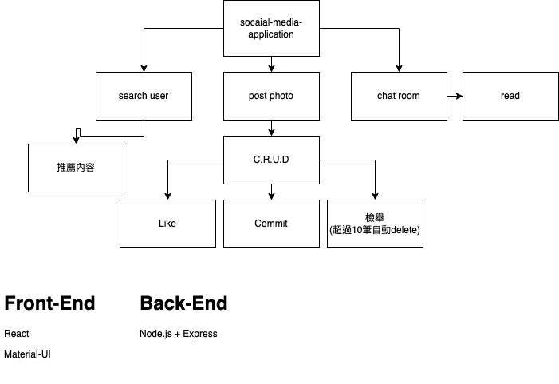
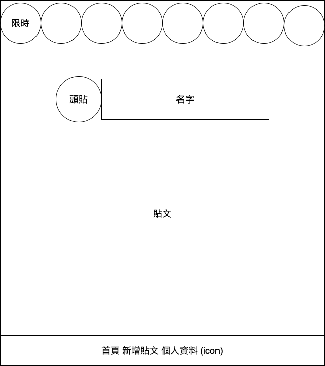
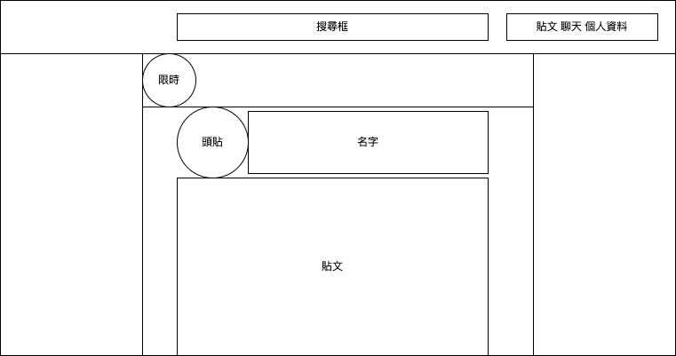
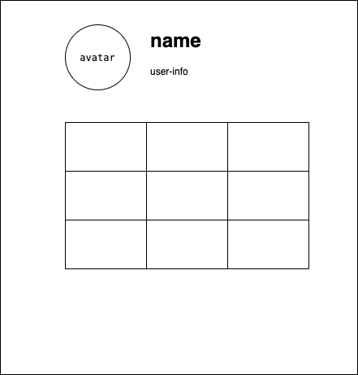
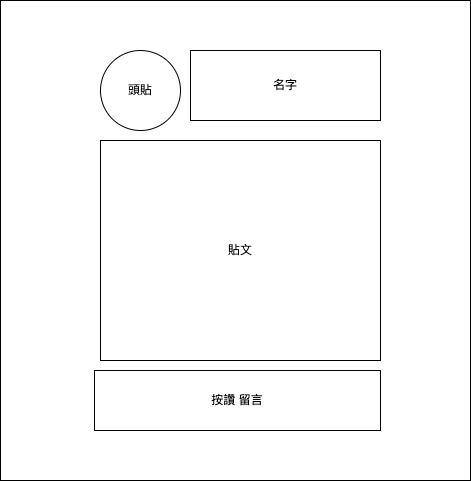

### 基礎架構圖

2022/06/15

專案基本功能架構

2022/07/02

手機版畫面

網頁版畫面

2022/07/06

個人資訊頁

貼文載入要搭配 lazy-loading，節省效能

貼文重點頁

經過思考過後不加入追蹤功能

## api 規劃

- 首頁有使用者選取頁面 - userA, userB, userC
- 選取其中一個使用者後，進入頁面打 api，取得其他兩為使用者的發文資料
